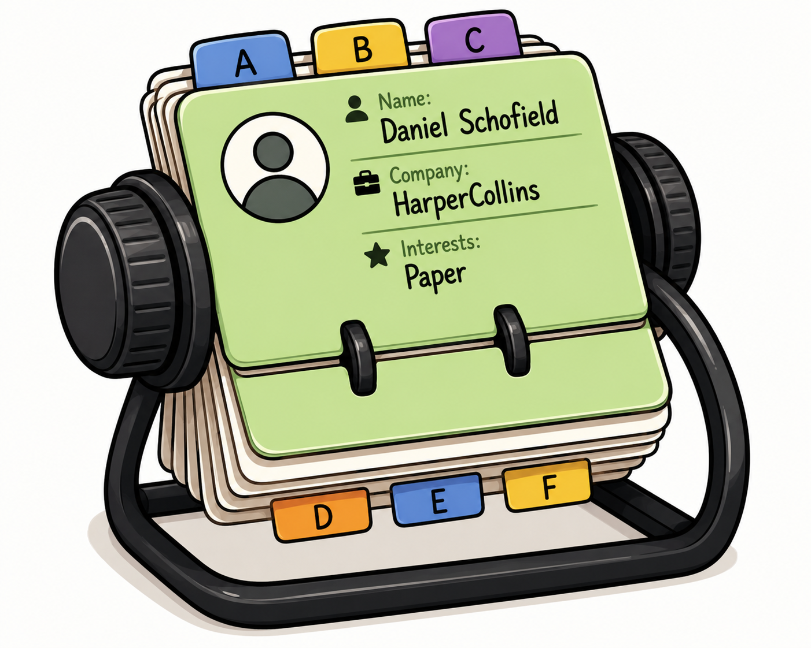

# Rolodex



> "Green means go, so I know to go ahead and shut up about it." — Michael Scott

A personal CRM for keeping track of the people in my life — birthdays, who's in which circle of
friends, when I last talked to someone, half-formed plans to see people, and the small details
worth remembering about them.

## Why this exists

I liked the idea behind [Monica](https://github.com/monicahq/monica), an open-source personal CRM,
but not the implementation. It's built for multi-tenant, self-hosted SaaS use, which brings along a
lot of generality — vaults, permissions, CardDAV sync, custom field templates — that a single-user
tool doesn't need. So this is a from-scratch rebuild, scoped to just me, borrowing Monica's better
data-model ideas where they made sense.

It runs quietly on a home server, reachable only over Tailscale. There's no login screen and no
multi-user support — the network boundary is the whole security model. That's a deliberate
tradeoff for a tool meant to run for years with as little upkeep as possible.

## What it does

- **People** — a profile per person: contact info, important dates, relationships to other people,
  circle memberships, pets, quick facts, and a running log of notes.
- **Circles** — loose groupings like "Family" or "Rock climbing friends," just for browsing and
  context. Not a hierarchy, not structural — that's what Relationships are for.
- **Relationships** — pairwise, typed ties between people (parent/child, sibling, spouse, close
  friend, and so on), shown correctly from both sides of the relationship.
- **Visits & events** — track a visit or trip from a loose idea through tentative plans to a
  confirmed date, with whoever's involved attached.
- **Reminders** — one-off or recurring nudges, optionally tied to a person or an event. Completing
  a recurring reminder just rolls its due date forward instead of disappearing.
- **Today** — the one page meant to actually get checked day to day: birthdays coming up, events
  that need a decision, reminders that are due, and a gentle nudge about people you haven't logged
  a note about in a while.
- **Google Contacts import** — a one-time command-line tool to seed a baseline from a Google
  Takeout export, so you don't have to type everyone in by hand. Details below.

## Stack

Go backend, SQLite for storage (the pure-Go `modernc.org/sqlite` driver, no cgo), server-rendered
HTML with [htmx](https://htmx.org) for interactivity — no separate frontend build, no JavaScript
framework. The whole thing compiles to a single static binary and runs in one Docker container.

The reasoning for Go over something like TypeScript/React: this app needs to sit on a home server
and keep working for years without much attention. A static binary with no runtime or dependency
management to babysit was worth more than client-side interactivity that a forms-and-lists app
doesn't really need. `PLANNING.md` has the fuller writeup, along with the data model this whole
thing is built around.

## Running it

### With Docker (the normal way)

```
docker compose up --build
```

Then visit `http://localhost:8090`. Data lives in `./data/people.db`, created automatically on
first run and persisted across restarts via a volume mount.

Port `8090` is just the default published port, picked to avoid clashing with other local dev
servers that tend to grab `8080`. Override it by setting `ROLODEX_PORT` — either inline
(`ROLODEX_PORT=9000 docker compose up -d`) or in a `.env` file next to `docker-compose.yml`
(gitignored, so it stays local to your machine). The app itself still listens on `8080` inside the
container regardless; only the host-side port changes.

### Locally, without Docker

Needs Go 1.25 or newer.

```
go run ./cmd/server
```

Defaults to `./data/people.db` and port `:8080` (this path bypasses Docker entirely, so the
`ROLODEX_PORT` override above doesn't apply here — use `ADDR` instead, see below). Override with
the `DB_PATH`, `STATIC_DIR`, and `ADDR` environment variables if you want something different.

If you edit any `.templ` file, regenerate the Go code it produces before building:

```
go run github.com/a-h/templ/cmd/templ@v0.3.1020 generate
```

## Project layout

```
cmd/server       entry point for the web app
cmd/import       one-time CLI for importing a Google Contacts export
internal/db      SQLite schema and connection setup
internal/model   the data layer — one file per entity (person.go, circle.go, event.go, ...),
                 plain SQL queries, no ORM
internal/web     HTTP handlers and the templ templates behind every page
internal/importer   vCard parsing/field-mapping logic behind cmd/import
static           htmx and the stylesheet
mocks             early UI mockups the pages were designed against
PLANNING.md       the running design doc — data model, scope decisions, and a status log
```

## Importing from Google Contacts

If you'd rather start from your existing contacts than enter everyone by hand:

1. Go to [Google Takeout](https://takeout.google.com), select only Contacts, and export as vCard.
2. Preview what would happen, without touching the database:
   ```
   go run ./cmd/import -dry-run ~/Downloads/contacts.vcf
   ```
3. Run it for real:
   ```
   go run ./cmd/import ~/Downloads/contacts.vcf
   ```

This creates a person for each contact along with their phone numbers, emails, addresses,
birthdays, notes, and job info, and turns Google's contact Labels into Circles automatically. It's
safe to run again later against a fresh export — anyone who already exists (matched by exact first
and last name) gets skipped rather than duplicated.

Run this with the Docker container stopped, or before starting it — SQLite only allows one writer
at a time, and the app and the import tool would otherwise be fighting over the same file.

This is a one-time seed, not an ongoing sync. There's no plan to keep this continuously in sync
with Google Contacts — the point of the app is to own this data independently.

## Testing

```
go test ./...
```

Every entity in `internal/model` has Store-level tests, and `internal/importer` has tests covering
the vCard-to-schema field mapping, including the odd edge cases (birthdays with no year known,
re-running an import without creating duplicates).

## Deploying

Meant to run on a home server over Tailscale, with nothing exposed to the public internet. Deploy
is just:

```
docker compose up -d --build
```

on the target machine, with `./data` persisted somewhere durable.

## Status

People, Circles, Visits & Events, Reminders, and the Today page are all built and working. Still
open: a JSON export for backups (planned, not built yet) and actually deploying this to a real
server. `PLANNING.md` has the current, more detailed status.

## License

MIT — see [LICENSE](LICENSE).
